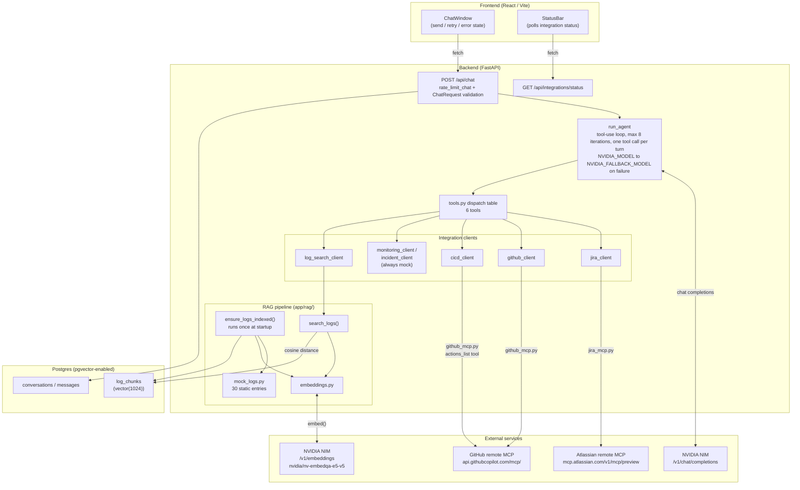
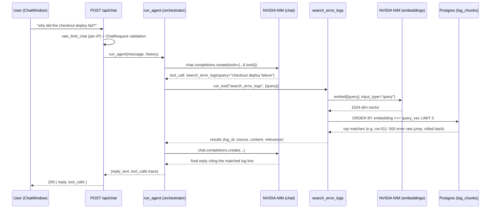

# Architecture

Two diagrams: the full component picture, and one representative request traced end-to-end. For
the reasoning behind non-obvious decisions (MCP endpoint quirks, the embedding model swap, the
zero-params tool rule, etc.), see `CLAUDE.md` — this doc is the map, `CLAUDE.md` is the field notes.

## Components

## Request lifecycle: "why did the checkout deploy fail?"

Traced end-to-end because it's the newest, least obvious path — it touches guardrails, the tool
loop, an embedding call, and pgvector, all in one request.

If the primary model (`NVIDIA_MODEL`) fails at either chat-completions call, `run_agent` retries
once against `NVIDIA_FALLBACK_MODEL` and continues the run on it — not shown above to keep the
happy path readable, see `CLAUDE.md`'s fallback-model paragraph.
